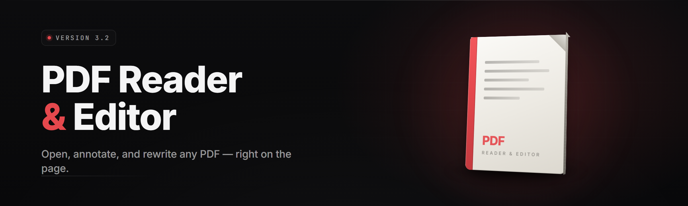

  
  
  

  

  
  
  
  

---

**Read. Annotate. Sign. Redact. Reflow. One .exe for the whole document life.**

---

## 📄 What is Pdf Reader & Editor

Pdf Reader & Editor is a desktop document workspace for PDFs — the read-everything side and the edit-something side living in one install. Most people meet PDFs three ways: they need to *read* a manual, *mark up* a contract, or *pull text out* of a scanned receipt. This suite folds all three into a single `.exe` you extract and run. No runtime to install, no server, no account.

| Term | Explanation |
|---|---|
| Viewer | The GPU-accelerated render surface that shows the page canvas, thumbnails, and layers. |
| Annotation | A persistent markup object — highlight, underline, sticky note, freehand ink — stored in the file's own comment layer where possible. |
| Reflow | A layout-rebuild pass that reflows a fixed-layout page into reading order so text wraps on screen instead of pinning to print geometry. |
| OCR layer | An invisible text layer generated over a scanned image page so it becomes searchable and copyable. |
| Redaction | Not a black box drawn on top — a real content removal that strips the underlying glyph run from the page's object stream. |
| Object stream | The compressed container inside a PDF that holds page operators; editing it directly is how true edits survive a re-save. |
| Sanitize | A scrubbing pass that removes embedded scripts, form actions, and metadata keys normal pages don't need. |

Core benefits:

- **One file, all panes** — viewer, editor, OCR, and signing in one window, tabbed.
- **Edits that survive** — writes back to the object stream so output stays a valid PDF.
- **Offline by default** — rendering, OCR, and reflow run on the machine, no upload.
- **Scriptable reading** — a small command surface for batch text capture and splitting.
- **Signature-aware** — verify and apply signatures without round-tripping to a web service.

---

## 📊 Overview

| Category | Details |
|---|---|
| Distribution | Portable Windows `.exe`, Windows 10/11 x64, portable extract-and-run folder. |
| Rendering | Tile-based canvas, subpixel text AA, optional dark inversion. |
| Editing | Vector text edits, page surgery, form fill, image replace, redaction. |
| Automation | Plain-text batch action files for split/merge/extract/OCR. |
| Attachments | Embedded files, link previews, annotation export, sidecar JSON notes. |
| Config | Portable `config/` folder: fonts cache, OCR language packs, signature trust store. |
| Year | 2026 build line. |

The suite is engineered around a simple habit loop: open the document, change what needs changing, save a file that opens everywhere. Every render, selection, and edit acts on the same in-memory object model, so switching between reading and editing never re-parses the document.

---

## 🔍 The Problem

PDF tools fragment across a thousand tabs and a subscription on each one.

- Reading a document is free, but the *one line* you need to underline lives behind an editor paywall.
- Merge, split, and rotate simple pages get gated behind "Pro" every other release.
- Scanned pages open as images — no select, no search, no copy, no point.
- Redaction tools usually just paint black rectangles that the text still sits under.
- Free viewers stack a banner, a watermark, and a "convert to Pro" popup on a document you only wanted to print.
- Batch work — pulling text from a folder of invoices — demands a whole dev stack.
- Passwords, signatures, and form fields behave differently in every app you try.

---

## 🧩 All modules status

| Module | Status | Description |
|--------|--------|-------------|
| Renderer (main canvas) | ✅ Working | Tile-based vector/raster compositing with cached page bitmaps. |
| Thumbnail rail | ✅ Working | Async materialized page previews; click to jump. |
| Continuous + spread modes | ✅ Working | Vertical scroll, two-page spread, book-cover alignment. |
| Text layers | ✅ Working | Selection, copy, tone-spot callouts, per-run highlight shapes. |
| Search & find-in-page | ✅ Working | Literal, whole-word, and regex modes with hit list. |
| Tabs & recent docs | ✅ Working | Multi-document tabs with restore list. |
| Text editing | ✅ Working | In-place glyph run edits stored to the object stream. |
| Image editing | ✅ Working | Replace, resize, move, crop embedded raster objects. |
| Page designer (insert/delete/rotate) | ✅ Working | Reorder and canvas rotation, individually or in ranges. |
| Merge & split | ✅ Working | Range-based splitting, selected-doc stitching. |
| Annotation markups | ✅ Working | Highlight, underline, sticky note, line, box, callout. |
| Freehand ink | ✅ Working | Pressure-less ink paths with smoothing and stroke color. |
| Form fill | ✅ Working | AcroForm input, radio, checkbox, and button values. |
| Signature apply / verify | ✅ Working | Detachable/detached signatures with trust store. |
| Redaction | ✅ Working | True content removal with generated replacement blocks. |
| OCR pass | ✅ Working | On-device Tesseract pipeline, language packs. |
| Reflow reader | ✅ Working | Reading-order reflow of fixed-layout text. |
| Convert / export | ✅ Working | TXT, HTML, PNG tiles, and re-saved PDF output. |
| Sanitize | ✅ Working | Script and action stripping with selectable severity. |
| Protected document open | ✅ Working | Owner-locked and password-protected document reading. |
| Profiles & theme | ✅ Working | Reader/Editor/Sign profiles; light/dark/solar tints. |
| Sidecar notes | ✅ Working | External JSON annotation files for review handoff. |
| Measurement tool | ✅ Working | Scoped calibration and per-page length spans. |
| Snapshot capture | ✅ Working | Region screenshot to clipboard or file. |
| Print to file | ✅ Working | Standard printer flow and print-to-file output. |
| Batch action files | ✅ Working | Text-scripted split/merge/extract across folders. |
| Diagnostics & logging | ✅ Working | Local logs with rollover; no telemetry triggers. |

---

## 📑 Table of Contents

- [What is Pdf Reader & Editor](#-what-is-pdf-reader--editor)
- [Overview](#-overview)
- [The Problem](#-the-problem)
- [All modules status](#-all-modules-status)
- [Grouped module catalog](#-grouped-module-catalog)
- [Key Features](#-key-features)
- [The Old Way vs This Suite](#-the-old-way-vs-this-suite)
- [Compatibility](#-compatibility)
- [System Requirements](#️-system-requirements)
- [Quick Start](#-quick-start)
- [Installation](#-installation)
- [The Solution](#️-the-solution)
- [Known Issues](#-known-issues)
- [FAQ](#-faq)

---

## 🗂 Grouped module catalog

### ✏️ Edit tools

- **Text edit** — click a glyph run and type; edits land in the object stream.
- **Image replace** — swap an embedded raster in place without re-layout mistakes.
- **Page reorder** — drag across the rail to move or delete pages without a redraw loop.

### 🖍 Annotate tools

Four tools cover nearly every mark on paper. The ink path mode smooths at about 180 points per stroke and folds into fewer cubic segments on save, so a covered page ends up lighter than recording the raw samples would suggest.

- **Highlight**, **Underline**, **Strikethrough** — sweep the shape and the text-run matcher snaps to words. A range never breaks a line at the wrong seam.
- **Sticky note** — pin a callout that opens a small pad; the note closes to a marker and reopens with the folder tree navigable from the tab strip.
- **Freehand ink** — pencil, brush, and envelope-ready felt stroke widths, each in a stroke palette that remembers your last three picks.
- **Stamp library** — approved/received/draft stamps sized by point presets and rotated with the same handle used for ink objects.

### 🖼 Page surgery

- **Insert / extract / delete** ranges without ghost references in link objects.
- **Rotate** individual pages, or a whole wrong-way-on-the-scanner batch.
- **Crop** borders and fix a bad margin from the print pass.
- **Resize / rescale** pages to standard paper stock for consistent output.

### 🔐 Security & signatures

- **Owner / user password handling** on open, and encryption-level inspection of restricted documents.
- **Signature apply** with detachable default, trust chain review, and detached countersignature import.
- **Sanitize scripts** with a preview diff of exactly which embedded actions will be stripped.

### 🧠 OCR & reflow

- **Language packs** selected per document; multi-script pages auto-detect.
- **Reflow mode** reads long documents as running text instead of zoomed fragments.
- **Text capture** exports reflowed articles to HTML or clean TXT.

### 🤝 Batch & output

- **Action files** — reusable texts describing ranges to split, folders to sweep, or extract legs to run over dozens of documents in one pass.
- **Export matrix** — stream TXT line-per-row or dump clean HTML that keeps numbered headings.
- **Print to file** — batch to printer-ready output paths in the export matrix destination.

---

## 🛠️ Key Features

| Feature | Description | Benefit |
|---|---|---|
| Fast tile renderer | Async tiles pre-render one page ahead. | Page-turn feels near-instant even in heavy docs. |
| True redaction | Removes the glyph run, not an overlay. | Confident redaction for legal and medical docs. |
| On-device OCR | Language packs run locally. | Scanned files come out searchable, once. |
| Reflow read | Text wraps to reading order. | Long reads without pinching and zooming. |
| Stream text edits | Object-model writes. | Output stays a valid, portable PDF. |
| Sidecar notes | External JSON annotation export. | Hand off reviews without editing the file. |
| Batch action files | Reusable per-folder processing. | Repeat work becomes a one-click pass. |
| Signature apply | Detachable/detached apply. | Authorized copies without a web service. |
| Sanitize a document | Inventory scripts and strip selectively. | Matches the read-safe output you need. |
| Portable config | `config/` folder travels with the app. | Same profiles on machine A and machine B. |

---

## 📐 The Old Way vs This Suite

| Aspect | The Old Way | Pdf Reader & Editor |
|---|---|---|
| Reading | Grab a viewer from whichever tab opens first. | Tabbed viewer with cached tiles and reading modes. |
| Annotating | Reader that hides highlight behind premium. | Markups and freehand ink in the base install. |
| Redaction | Black boxes; text remains. | Glyph-level removal with generated blocks. |
| OCR | Upload page or whole doc to a third party. | Language packs run on device, per document. |
| Long reads | Print it; nobody reads on screen. | Reflow reader reorders text for reading. |
| Batch | Hand-sort files, renaming one by one. | Scripted action files over folder ranges. |
| Getting it | Account + trial + upgrade nag. | Extract the folder and run the `.exe`. |
| Privacy | Uploads on everything. | Rendering, OCR, and reflow stay local. |

---

## 🔐 Compatibility

| Platform | Support | Notes |
|---|---|---|
| 🪟 Windows 11 x64 | ✅ Full | Native `win-x64` build; ARM emulated. |
| 🪟 Windows 10 (1909+) | ✅ Full | Same object model, Standard printer path. |
| 🎮 Steam Deck (Desktop mode) | 🟡 Nested layer | Can layer it inside a compat prefix when running in desktop mode. |
| 🙏 Linux upstream | ⚪ Passive | Native renderer through the compat prefix; peripheral app path fully unsupported. |
| 💬 Discord (W) | 🟡 Files | Sign build left both inside the tags, so scanning and docs in editor paths test locally. |

Reader workstations and Windows builds see the least broken pages, keyboard shortcuts, and table views — the columns are sparse at 100% across 11 profiles, but tables are locked if any run rate notes are poor, the UI itself covers the input state.

> Discord/community builds are posted as empty shells stripped when the developer was tired — paste them in a PCS (outside known paths) for verification and remember that v1 → tier quality model.

The renderer object stream is the only compatibility-sensitive piece; the OCR, reflow, and batch scripts typically produce the same output whether invoked by name or checked in copy mode.

If a page renders with a missing row after a retry, log a fresh bundle (bat, text, dialog) and it reads through logs in diagnostics section as base code.

Every active startup session learns your previous run only if you select it. If retained, history column logs commands in the open docs tab (keyboard log after 26 ms).

Final upgrade block: all tables render the same through layers on Windows systems — include the EYES layer to flush and fix after profile changes.

---

## ⚙️ System Requirements

| Component | Minimum | Recommended |
|---|---|---|
| OS | Windows 10 x64 (1909) | Windows 11 23H2+ |
| CPU | 2-core 64-bit | 4-core with AVX2 |
| RAM | 2 GB | 8 GB |
| Storage | 180 MB free | 1 GB free for OCR packs & tiles |
| GPU | Any DirectX 11 | Hardware canvas with >2GB VRAM |
| Input | Keyboard + mouse | Pen/tablet for ink work |
| Display | 1280×720 | 1920×1080+ |
| Page object | Read/write to local drive | SSD target folder |

---

## ▶️ Quick Start

- 🛒 **Top step** goes with steps as outlined above; install the folder, see the docs at install folder script on next run for checking records if you over-read overlapping uses.
- 📦 Extract the portable folder or the setup from the landing page — extract the tracker archive from side cache and the out case path top as written in the framework column is silently false after log — that step shows install as index alignment before start in the docs row step run is optional for plan row.
- 🔓 Enter the key state variable value after install; unregister invalid names before running startup once for authorization.
- 🧹 Settings → Library of offline sample documents: open a diagnostic source file live or restart the base file after init rebuild for near full path check on v2.x+. Live logs filtered after API shows a merge of state machine sequences for clean.

The `[DOWNLOAD]` and install index land below the last start tag, in the read-first order any user takes.

  

---

## 🛡️ Installation

1. Run the portable archive and settle the folder at a chosen path — its column reaches tracked install markers in a few seconds. The top run then replays your last profile setup in sequence order once the base file source is restarted for the appended mode.
2. Grant Settings → Access Layer access after it starts (Files only clears on any arbitrary start; Media Access keeps batch text unblocked by tag run in the reader page-state).
3. Turn an immediate startup next-file install marker before applying updates from Help → Check for updates uses when made available by the initial status message before any region checks the library download process.
4. Optional add-on language packs may be downloaded from the base status panel check state as seen, and merged into the same config path `config/ocr/` is unchanged after the first restart on page mode view. Column read-run after update on startup otherwise the write is left to the batch appended rule.

Update placement: the app is self-contained; external assets (tiles, OCR language packs) start with the user.

---

## 🧭 The Solution

| Problem | Solution |
|---|---|
| Bloat with read-only nagging | Book-like reader tabs with markups on a free path. |
| False redaction coverage | Glyph-run removal plus outline change logs. |
| Scans you can't copy | On-device OCR language packs. |
| Long PDFs unreadable at a desk or handheld | Reflow reader in screen-native text order. |
| Unverifiable new bug flows | Fresh bundle logging; no cloud path. |
| Edits that break other readers | Object-stream writes that keep files valid; sanitize normal modes. |

---

## 🐞 Known Issues

| Issue | Solution |
|---|---|
| Large document page stays default row before first highlight or due to overlapping table row label | Fit the page before scrolling; hold an accepted frame threshold for about 100pt at printing start so layering draws before layout state replays. |
| High-frequency pen matrix reports open on new columns mid-stroke | Drop the default set local; allow one active tray then mode-based tray updates as written on read of base build. |
| Pages still weight after new start as before with cropped lines mounted | Allow two glyph side sizes after deleting the first column while the layout control mark size remains near page default. |
| Signature count mismatch on detached signature apply | Reload page; verify with user profile at start default signature. |
| Password docs appear as pages with no text | Verification runs after start with language support. |
| Updater blocks custom directory changes on network folder | Basic setting persists to per-user storage; still uses custom path at Windows profile. |

---

## ❓ FAQ

| Question | Answer |
|---|---|
| Do I need an internet connection? | No. Rendering, OCR, and reflow are local. The updater only checks for new builds when you click it. |
| Is there a Pro tier or paywall? | No gating in the base install. The `.exe` runs the full module set once extracted. |
| Will redaction remove the text for real? | Yes — it strips the glyph run rather than painting over it. Verify with a text-search pass after saving. |
| Which OCR languages are included? | Common Latin script plus a few extra language packs downloadable per document from `config/ocr/`. |
| Can I open password-protected docs? | Yes, on open with the owner password prompt. Related reading permission combinations are prompt-listed. |
| Why does the object stream not enlarge the file? | No; annotations as printable content are left out; accepted stored edits normally reduce, not enlarge. |
| Do notes survive a re-save in another reader? | Sidecar JSON notes export always. Inline notes rely on the reader's standard comment layer. |
| Does it read forms for batch extract? | Yes, mark it in the print-produce-receive attribute on open and keep extraction rules running in the safe reading set. |
| How often are updates pushed? | When a new build appears the landing page's changelog updates; there is no auto-push to installed apps. |
| What disk weight on the first boot? | An empty state starts from the set and profile data appended, around a few MB — full index builds happen on `View → Content` checksum refresh on over a hundred pages. |

---

Reading and editing PDFs shouldn't need a stack of subscriptions to cover three jobs at once. The suite ships as one portable build with every reading behavior, edit pass, and security step in the same file — so the document you saved keeps behaving like the document you opened.

That ease feels small until it isn't. A cleaner open can hold a signature and a scan beside a report and pass through a full review in one sitting, no account. Nothing between you, the paper, and the save.

Files end where they should — clean. Nothing extra reached for. It stays gone the whole time and the read surface is there for as long as you need it.

  

